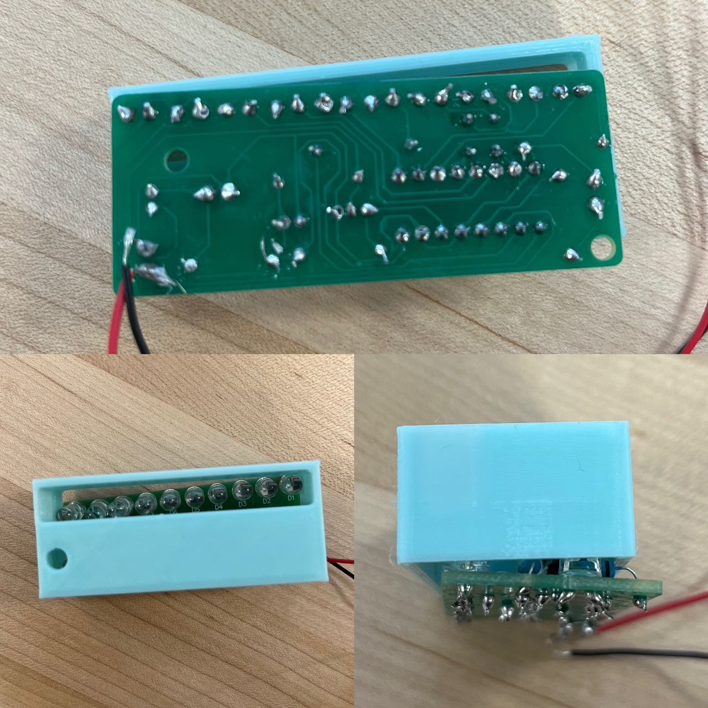

# Intro
For this project. My partner Ivy and I first soldered a board and then measured it. We then designed a 3D print for the board and a laser cut for the battery enclosure.

# Purpose
The purpose of this project is to learn how to solder and to design a 3D print and laser cut for a circuit board. And to learn how to measure accurately so that we can enclose the circuit board and the battery cap with 3d printing and laser cutting.

# Soldering 
The soldering process itself worked well. We were told to aim for a shinny spherical finish. After doing a few, I found out that the best way to do that is to remember the following tips:

- *Do it Fast*: The longer the soldering kit is touching the solder metal, the darker and duller it'll look.
- *Use a small controlled movement*: After combing my own experience from the past and the professor's instruction, I found out that the best way to have a perfect amount of solder is to use the residue from the tip of the soldering kit to dab on the part that needs the solder. 

## image
<!-- insert a picture of the soldering  -->

## reflection
The result to me looks good. However, we misplaced the resistor therefore it does not turn on. Another thing I learned from the instructions is that I need to smear a layer of solder onto the heating tip to avoid it being burnt. I never knew to do that before. I am glad that I took this class and now I know to use to best practice. 

# Measurement
After building the electronics kit, we used digital calipers to measure the dimensions. 

All the measurements are in millimeters. The top 5.92 is the space left for the opening of the line of LED lights. Same with the 5.15*5.15 square opening. 

The 64.84 is the length, 15.98 is the height at the highest spot, and 25.97 is the initial measurement for width. After adding every measurements from the left side together it adds up to be 26.45, which was actually more accurate.

# Design Plan 
We worked together to design a schematic for the enclosure. It contains 3 parts. 
1) Enclosure for the circuit but with the bottom and the LED lights exposed. *(As seen on the picture above)*

2) Enclosure for the battery caps

3) A cilinder to connect everything together.
<!-- include a picture of the cilinder design -->

# Iterations: 3-D prints for circuit board

## CAD
Here is a screenshot of the CAD Design for 3D Printing.

Here is the CAD design for the circuit board enclosure.

## 1st Iteration
The first iteration did not fit that well. The fit was smaller in both width and length. 

After that. I wanted to measure how off I was by measuring the difference. But I decided to redo my measurement as it was off by a lot. Also my previous Fusion 360 design did not utilize variables. Therefore I also redid the design on Fusion 360 with the new measurement. And that moves me to the second iteration...

## 2nd Iteration
The second iteration fits much better, with one little twist:
 

The LED light openings on the side was on the wrong direction. But everything else fits really well. The side *(as seen on the top right corner)* looks a little off from the CAD design. This is because I did not put support when 3-D printing. So the top fell off and I had to cut it off.

Knowing what to improve, I began my 3rd iteration:

## 3rd Iteration

I switched the side for the LED opening  `mirror` function on Fusion360. The print shows a perfect fit

## Battery Cap Enclosure
With the previous knowledge from the circuit cap, we made more accurate measurement and left enough room for wiggle. The first iteration fits perfectly.

I left room on side for the wires to go through. 

### Reflection:
This made me realized how important it is to measure accurately.

# Laser Cutting
The hardest part of laser cutting was getting the CAD right. Just by following the instructions was not enough. There were many issues that came up during the CAD process on Fusion 360.

## Setting 
The setting of Lightburn was later changed into Speed: 25mm/s, Power Max: 100%

## CAD
Here is a screenshot of the CAD Design for Laser Cutting.

The image shows the 3d design, the printing process and then final cut.

It fits well but the edges weren't big enough so we had to use a lot of glue.

# Summary
The 3D print and laser cut for the circuit board and battery cap enclosure fits well. The 3D print for the circuit board enclosure fits well after the 3rd iteration. The laser cut for the battery cap enclosure fits well. The edges weren't big enough so we had to use a lot of glue.
### Difference between 2 design processes (Additive vs Subtractive)
The 3D print is a lot more forgiving. I can just print another one if it doesn't fit. I can rapidly prototype. It is also easier to build the CAD file. The laser cut CAD is a lot more work and seemed very repetitive. In terms of Additive vs Subtractive, I like the difference in the process because for 3-D printing it is a lot less restriction as you have the world to build on, but for laser cutting, you are forced to work with one big piece and cut away from it.
### Reflection:
I learned that the laser cut is a lot more precise than the 3D print. I didn't have to change any measurements after it's designed. I learned to use the Fusion 360 better. What I didn't like about the process of designing the finger fit box is that the end product is very predictable, repetitive and there's not much room for creativity. This should be very easy to be automated. However, I tried looking up how to do it but I can't find any existing tools. Maybe there are tours out there but I just don't know? 