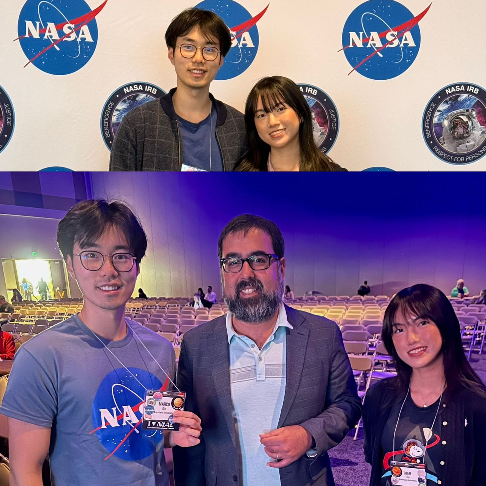

# Thoughts
Why did we send people to the Moon? Why are we going to Mars? 

These questions were answered at the NASA HRP conference, during a presentation by Amit Kshatriya, Deputy Associate Administrator for the Moon to Mars Program at NASA. I asked him if we are ever going to be a two-planet species, he said "I wish." 

*(My girlfriend Ivy and I with Amit Kshatriya)*

To answer the previous question: "Why did we send people to the Moon? Why are we going to Mars?"

It's not only for the sake of science but also to inspire the next generations of scientists and engineers.
I, too, was among those inspired. Growing up, my dream was to become an astrophysicist. My room is filled with telescopes, Moon globes, Mars globes, and LEGO sets of NASA spacecraft. 

This year, I was fortunate enough to attend a NASA conference, thanks to the opportunity provided by Vivek Vimal from the Ashton Graybiel Spatial Orientation Lab and the sponsorship from Brandeis Innovation.
It was truly an eye-opening experience. First, I would like to thank Ivy Tran for accompanying me and always offering her support. I connected with great people, witnessed some amazing inventions, learned how commercial companies utilize NASA inventions, and understood the phases of Artemis. I also saw Vivek present his research, to which I contributed as a single data point, on stage with great energy and passion. His poster presentation about engaging the community through fashion, dance, and science was particularly memorable.

During Vivek’s poster presentation, I also presented the exploration work I did with him. I received great insights from the audience. It was my first time giving a poster presentation, so I was constantly adjusting. I changed my pace, fine-tuned what to cover in the speech, and decided what to leave out for questions, becoming more fluent with each presentation. Being the sole undergraduate among PhDs, industry experts, and even astronauts did not intimidate me but fueled my ambition to grow and one day become an expert in many fields.
Some of my friends ask me why I participate in competitions every weekend. I always tell them this: “I do them not because they are easy, but because they are hard.”

## Vivek’s Poster Presentation:

I am very grateful for the opportunity because I got to experience first-handedly a poster presentation. Vivek let me talk about the part that we did together on a distance-to-vibration device. When we were preparing, we first wrote down everything that’s important in this experiment. I read it and it turned out to be 2 minutes. Then I tried to narrow it down to just 1 minute which took a while. I was able to do so in the end and still make it sound natural. After Vivek saw the draft he told me I could also just say it in natural language and not go with the script. 

At the actual poster presentation, while Vivek is giving his spiel, he let me present a small part of it as well. At first I tried to mention everything that’s on the draft, but it seemed very long, and hard to keep people interested. Each time I give the talk, I try to narrow it down and only pick out the interesting parts. People then later ask questions, and that’s when I explain deeper into how we designed this study and the motivation behind it. After a few trials I have become better at it and the speech are more natural and feels more like a conversation. This reminds me of what Vivek told me to do before is to have a script and then just talk in natural language.

# Galveston Island
## Food
The shrimp was so fresh! I am in love with the bacon wrapped shrimp

## Beach

## Mardi Gras
I was lucky enough to be in Galveston during Mardi Gras

