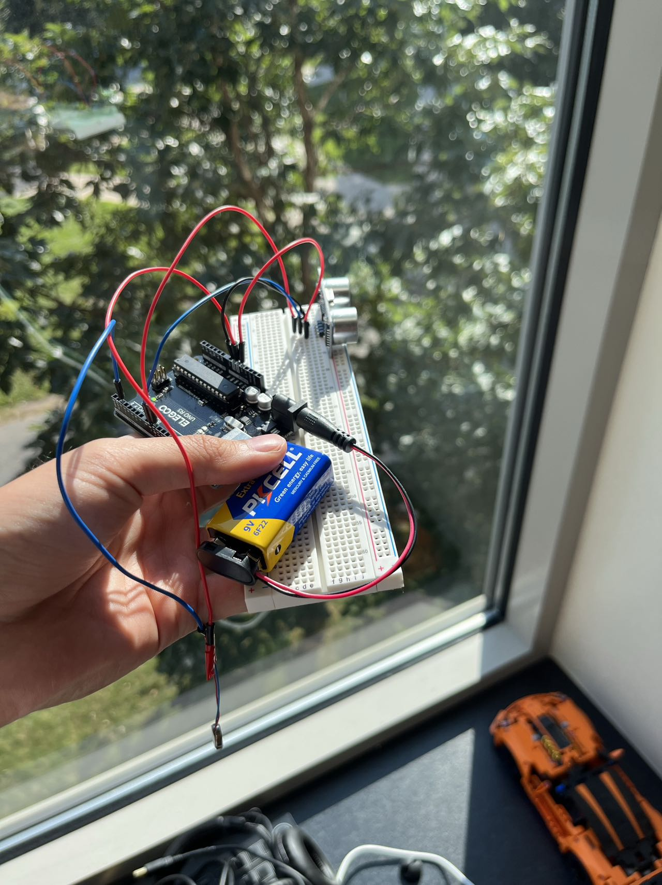

# Inspiration

I built the device to understand how different types of vibrations affect human's perception of distance. I planned to use ultrasonic distance sensor and some vibrotacors which are these small round things that makes a vibration. 

# Learning Phase

I have been a software engineer, so I had to learn about how to use hardware. Although I learned about resisters and capacitors in middle school, I had to relearn them. I also learned about how to use a breadboard and how to solder.

# First Iteration

For this first iteration I simply connected everything on a breadboard and uploaded the codes using Arduino IDE.

The goal of this first device is to see if everything works. And then I held it in my hand (which was not comfortable) and walked around to see if I can feel the vibration. I also asked my friends to try it out.

# Second Iteration

For the second iteration, I added a sleeve so that I can wear it on my arm.

Then I switched the ultrasonic distance sensor to the front after experimenting holding it. 

# Third Iteration
This iteration is handheld, because from experimenting, a person has a better sense of distance when they are holding the device.

I also shrink down the size significantly by using a smaller breadboard.

This was much easier to hold. I used this iteration to run my pre-pre-pilot test for my experiment. The feedback was that it was easier to hold but still not comfortable. This might take away attention from the participants in the experiment.

# Fourth Iteration
The device is now being covered with a lazer cut clear case. This made it more comfortable to hold as it has less exposed parts.

# Fifth Iteration
The device is now on a belt. This is the iteration where I used to run my pre-pilot test. 

The reason for the belt is that it is more comfortable to wear and we don't want people to get tired from holding the device. We also took out the battery as we are connecting it to a computer to record the data.

# Future Iterations

From running the pre-pilot experiment, we were placing the vibrotactors on their forehead and the back of their head. This might create differences in the intensity of the vibration. We will need to find a way to fix that.

On more of a software side, we want to find a way to use the computer that is connected to the device via a wire to start and stop the vibration and record time. This would make it easier and more accurate to record the data. As now we have to unplug the device and physically record with a phone. 