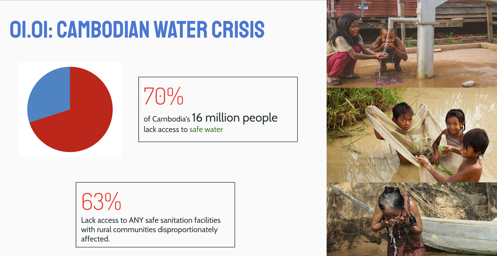
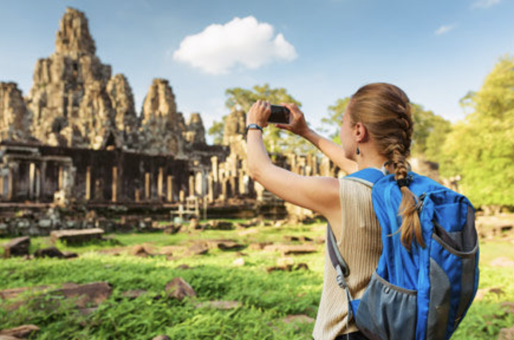
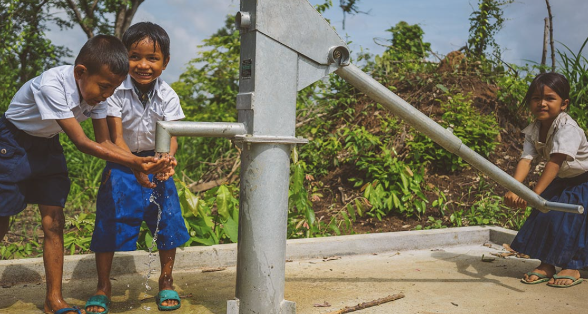
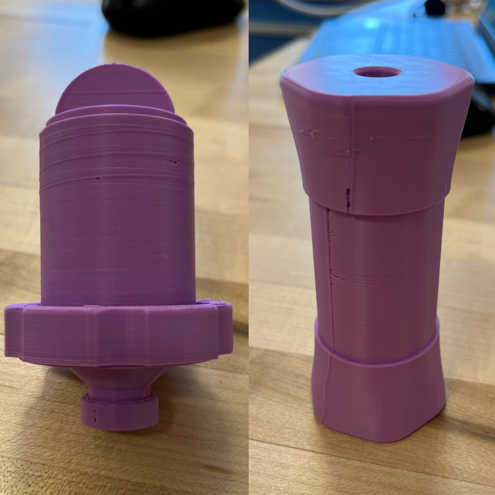
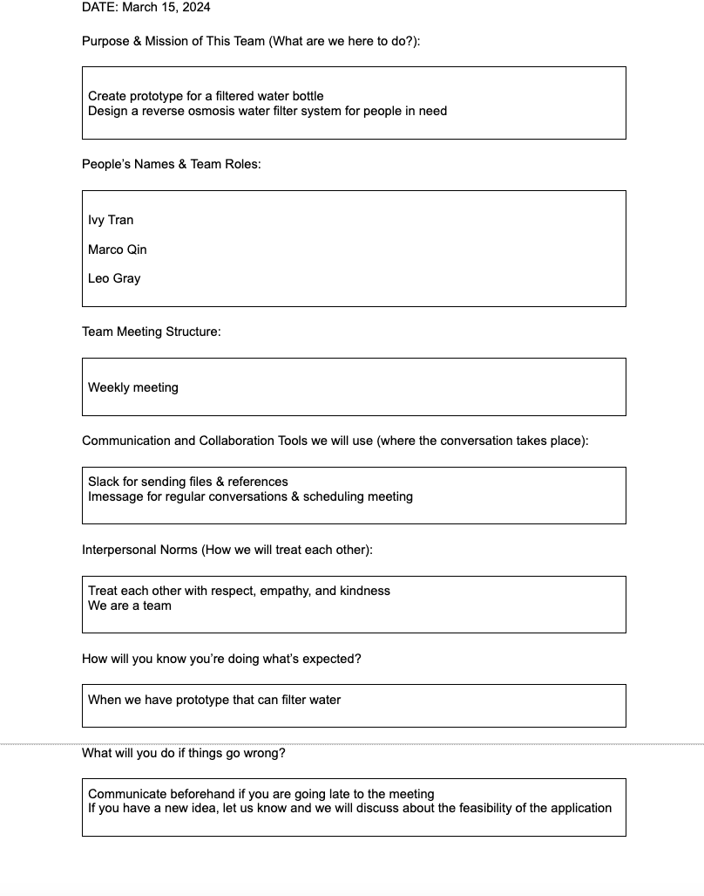

# Introduction
In response to the acute water crisis in Cambodia, where access to safe drinking water is a daily struggle for millions, our project, "Aquality", was initiated. This project aims to devise practical and innovative solutions that not only offer immediate relief through user-friendly water filtration devices but also contribute to sustainable practices by engaging tourists in a meaningful way. 

# Problem

## Water Crisis in Cambodia:

- 70% of Cambodia's 16 million people lack access to safe water, and 63% lack access to safe sanitation facilities, with rural communities disproportionately affected.
- Water contamination arises from various sources, including inadequate waste disposal, where plastic trash near food sources leaches toxins into the water supply.
- The major pollutants of the Cambodian water is arsenic and E. coli. Arsenic is hard to get rid of with traditional methods, and can not be eliminated by boiling water. E. coli is a bacteria that can cause severe illness and even death.

# Existing Solutions:

### UV Light

| Aspect       | Description                                                                                                        |
|--------------|--------------------------------------------------------------------------------------------------------------------|
| **Description** | Uses ultraviolet light to kill or inactivate microorganisms by destroying nucleic acids and disrupting their DNA. |
| **Pros**        | - Effective at inactivating bacteria, viruses, and other pathogens.                                                |
| **Cons**        | - Needs electricity to operate, which may not be readily available in all areas.                                   |

### Rain Water Filtration

| Aspect       | Description                                                                                                        |
|--------------|--------------------------------------------------------------------------------------------------------------------|
| **Description** | Involves collecting rainwater and passing it through a series of filters to remove particulates and contaminants. |
| **Pros**        | - Utilizes a renewable resource. - Can be scaled based on the size of the collection area and storage capacity. |
| **Cons**        | - Limited by seasonal availability and the need for storage solutions. - Requires a large surface area for collection. |

### Boiling Water

| Aspect       | Description                                                                                                        |
|--------------|--------------------------------------------------------------------------------------------------------------------|
| **Description** | A common practice that involves heating water to a rolling boil to kill bacteria, viruses, and parasites.          |
| **Pros**        | - Simple and effective method to disinfect water.                                                                  |
| **Cons**        | - Fuel costs and time constraints limit its accessibility.                                                         |

### Sedimentation

| Aspect       | Description                                                                                                        |
|--------------|--------------------------------------------------------------------------------------------------------------------|
| **Description** | A process where water passes through layers of different sized grains to trap and remove larger particles.         |
| **Pros**        | - Simple and low-cost method. - Can significantly reduce the load of suspended solids.                          |
| **Cons**        | - Does not effectively remove dissolved contaminants like arsenic or microbes like E. coli. - Not suitable for direct implementation in a water bottle due to size and flow rate constraints. |

### Carbon Filtration

| Aspect       | Description                                                                                                        |
|--------------|--------------------------------------------------------------------------------------------------------------------|
| **Description** | Involves passing water through activated carbon filters to absorb bacteria and other contaminants.                 |
| **Pros**        | - Effective at improving water taste and odor. - Can reduce the presence of some chemical contaminants and pathogens. |
| **Cons**        | - Not effective against all types of contaminants, including certain heavy metals like arsenic. - Suitable for water bottle integration, but requires regular replacement of the carbon filter. |

### Reverse Osmosis

| Aspect       | Description                                                                                                        |
|--------------|--------------------------------------------------------------------------------------------------------------------|
| **Description** | Uses a semi-permeable membrane to remove ions, unwanted molecules, and larger particles from drinking water.       |
| **Pros**        | - Highly effective at removing a wide range of contaminants, including arsenic and bacteria like E. coli. - Produces high-quality drinking water. |
| **Cons**        | - Requires significant pressure and energy, making it less practical for low-resource settings without modifications. - The complexity and cost of the system might not be suitable for direct integration into a water bottle but can serve as a community-level solution. |

# Customer Profiles

## 1. Tourists Purchasing Water Bottles

### Who are they?
Tourists looking to explore new cultures and experiences, often conscious of their environmental impact and interested in contributing to the places they visit.

### What do they do over the course of the day?
They spend their days sightseeing, engaging in local activities, and looking for meaningful ways to contribute to the sustainability and well-being of the places they visit.

### Where will you find them?
Primarily in airports upon arrival or departure, where they are more likely to be informed about local issues like the water crisis and motivated by the opportunity to help through their purchases.

### Why would they be interested?
By educating tourists about the water crisis in Cambodia at points of sale like airports, they can be motivated by the dual benefit of acquiring a practical item like a water bottle that also serves a philanthropic purpose. Understanding that their purchase contributes directly to building water filtration systems in Cambodia can incentivize them to support the cause.

## 2. Cambodian Rural Villages

### Who are they?
Residents of rural Cambodian villages, often living in areas where access to clean and safe drinking water is limited or non-existent.

### What do they do over the course of the day?
Their daily routines typically revolve around agricultural work, household maintenance, and community engagement. Access to clean water is a critical part of their day, affecting health, hygiene, and overall quality of life.

### Where will you find them?
In rural and remote areas of Cambodia, often far from urban centers where water infrastructure is more developed. These communities are typically spread out, with centralized locations like community centers or schools acting as gathering points.

### Why would they be interested?
The introduction of a community-based water filtration system addresses a fundamental need for clean water, directly impacting their health and daily lives. Ease of use and access are key, with the system designed to be simple for anyone in the village to use and maintain. The promise of a reliable source of clean water can significantly improve the quality of life, reduce disease, and support the community's overall well-being.

# Existing Hardware Solutions

We found some open-sourced hardware solutions that are similar to our design. Here are some examples: 
-  [Open Source 3D Printed Water Filter](https://www.instructables.com/Open-Source-3D-Printed-Water-Filter/)  
- [GRAVITY FILTER COVER](https://cults3d.com/en/3d-model/various/gravity-filter-cover-for-msr-autoflow)
- [Self Cleaning Rain Water Filter With No Moving Parts](https://www.instructables.com/Self-Cleaning-Rain-Water-Filter-With-No-Moving-Par/)

We printed out the water filter and the gravity filter and tested them with water and without the activated carbon. We understand that we need to treat it with resin as the cracks of the 3-d prints will have bacteria. In the future, once we have figured out the design, we will send it to a manufacturer like "[sendcutsent](sendcutsend.com)" to make it out of a more durable material. 

# Team
## Members Agreement

# Key Features
## Water Bottle Attachment
For the consumer facing product, we hope to have a water filter in a water bottle. We want to have it be able to filter through chemicals as well but that might not be able to fit in a water filter in a water bottle.

## Community Water Filtration System
For the community facing product, we hope to have a water filtration system that can be attached to a water source. We hope to have it be able to filter through chemicals as well. This also best to not need any electricity, and need minimal maintenance. 

# Measuring Success 
## Objective
To develop and implement a 3D-printed water filtration system that is accessible, efficient, and user-friendly for a single Cambodian village within a month.

### Immediate Impact:
- **Functionality**: The water filtration system must be operable immediately upon installation.
- **Water Quality**: Achieve a significant reduction in key contaminants (specifically arsenic and E. coli) to levels safe for human consumption as per WHO guidelines.

## Design thinking Methods

- Big Idea Vignettes: We generated multiple big ideas to solve the big problem, get consumers to buy the water bottles and the profit goes to building water filtration systems in Cambodia to solve their issue
### Exercise 
To harness the power of storytelling, we employed Big Idea Vignettes to illustrate the transformative potential of our water filtration systems in Cambodia. We developed a series of short, impactful stories, each accompanied by vivid conceptual sketches. One vignette depicts a Cambodian child, previously suffering from waterborne diseases, now healthy and attending school regularly thanks to the community's new filtration system. Another shows a tourist who purchases a water bottle and learns that their contribution funds the installation of these vital systems. These narratives are designed to create an emotional connection with our stakeholders, highlighting the direct social impact of their contributions.
- Empathy Mapping
### Exercise
To deepen our understanding of the users' needs and experiences, we conducted Empathy Mapping for two main stakeholder groups: tourists and rural Cambodian villagers. For tourists, we explored what they see, hear, think, and feel when encountering the water crisis during their visit. This helped us tailor marketing messages that resonate deeply with their values of travel and philanthropy. For the villagers, we mapped out daily challenges related to water access, which informed the design features of our community water filtration systems, ensuring they are user-friendly and effectively address the specific contaminants present in their water sources.

# Conclusion

Reflecting on the outcomes of this project, we achieved several of our design goals. Our prototypes were successfully developed and tested, indicating a high potential for scalability and impact. We learned the importance of grounding technological innovations in real human experiences—ensuring that our solutions are not only effective but also embraced by those they are meant to help. The use of Big Idea Vignettes and Empathy Mapping proved instrumental in bridging the gap between technical solutions and human-centric design, allowing us to refine our approach in a manner that is both empathetic and pragmatic. As we move forward, these learnings will guide the next phases of our project, driving us closer to our ultimate goal of providing sustainable water solutions to Cambodia.

