# Introduction
In this project, we are designing a water filter that can be used by people in Cambodia. The filter must be easy to use and maintain, cheap to produce, and able to filter out the bacteria and viruses that cause waterborne diseases. We will iterate through multiple designs and test them to find the best design.

# Needs Statement

The 70% of the Cambodian people who don't have access to clean water need a way to filter their water, cheap, easy to maintain sso that they can avoid waterborne diseases.

# Design Principles

## 1. The filter must be easy to use and maintain
### ways to measure
- The filter must not require any special tools to maintain
- no power needed 
- The filter must be easy to clean or replace

## 2. The filter must be cheap to produce
### ways to measure
- The filter must be made of cheap materials
- The filter must be easy to produce in large quantities

## 3. The filter must be able to filter out the bacteria and viruses that cause waterborne diseases
### ways to measure
- The filter must be able to filter out bacteria and viruses
- The PPM of the water must be under the WHO standard when using the pond water from Charles River.

# Design Process
## Drawings
From the Design Principles, we discussed how we want the filter to interact with the bigger container. We thought this was necessary because it consolidate our ideas so we can be more clear when we are building the CAD and CAM
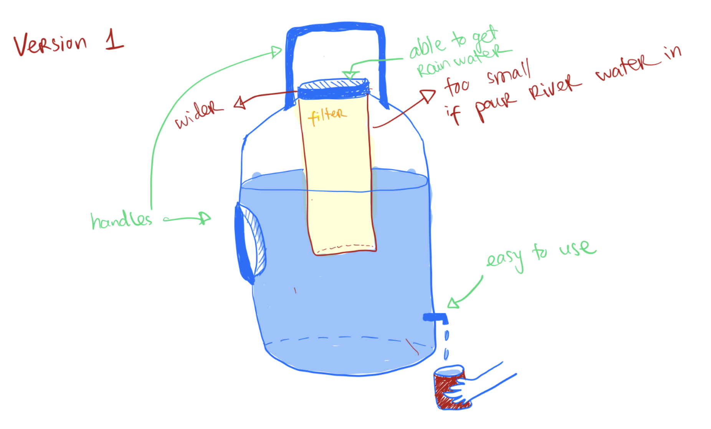
This is The first design. We thought to integrate the filter to the top of the container like a britta filter. However, just like a britta filter, we realized that the amount of water it can hold is determined by the size of the chamber of the filter. Which is why in next iteration we will address that problem.

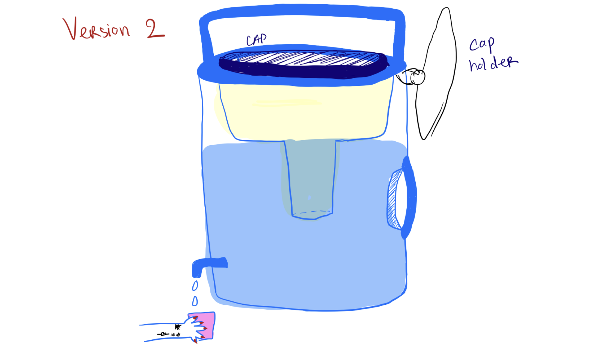
For the second version of sketch, we thought to improve the previous idea of being able to hold as much water in one setting. We imagined people using this near a river and would want to hold as much water as possible in one setting so they don't have to wait or go back and forth. 

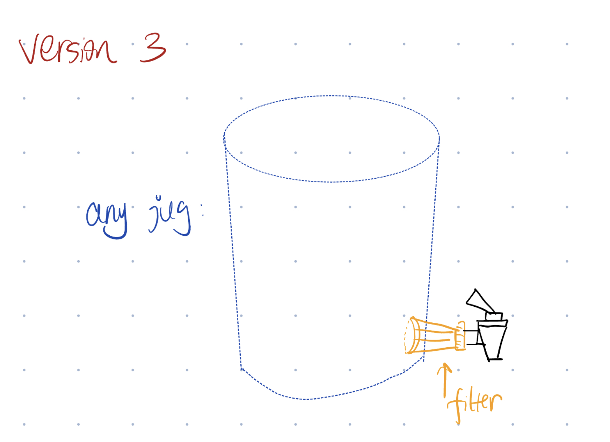
For the third version, we want to be able to adapt the filter to any container that they have. In this way, they can hold even more river water in one setting because the limit is how big their container is. It also makes it cheaper because they can reuse an existing bucket or container they have. When changing the filter, they just need to unscrew the cap and put in new material for the filter. We can also adapt a ceramic filter by putting a porous pot with no glaze in the container. 

## First Iteration
We printed out the some of the existing filter containers to check how well they would work with our design.  
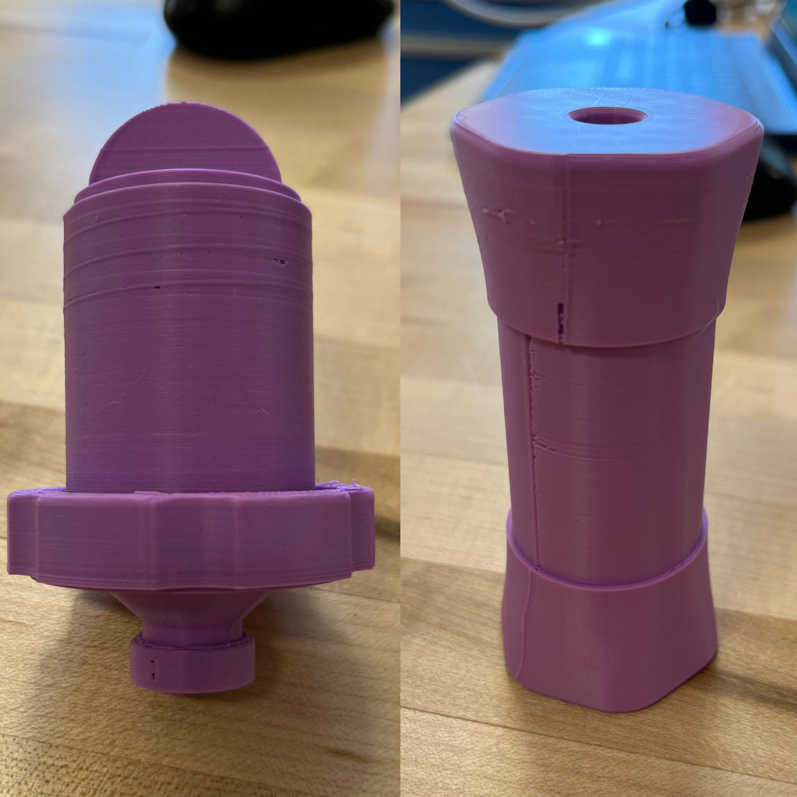
We found out that water will leak through the cracks so we will need resin coding to make it water tight. We also decided to use the design on the left because it is easier to screw in and out. To better adapt this design to our filter, we will also make a tap on the bottom of the filter to control the water flow. We also plan to get rid of the cap so it can be fitted into a container.

## Second Iteration
We redesigned the filter to better integrate with the container, we also printed a tap to try to see how well it fits.
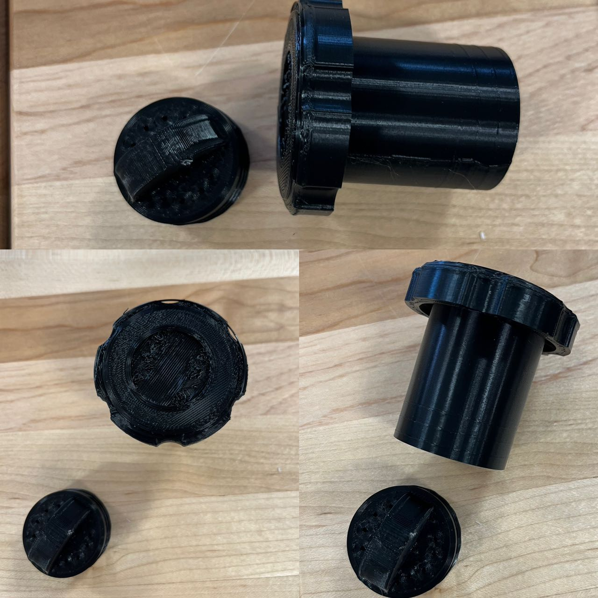
This second filter needs improvement as there's not enough holes for water to flow through. We will also need to make the top smaller so it can fit into a container. We also need to make the screw smaller so it can screw in easier.
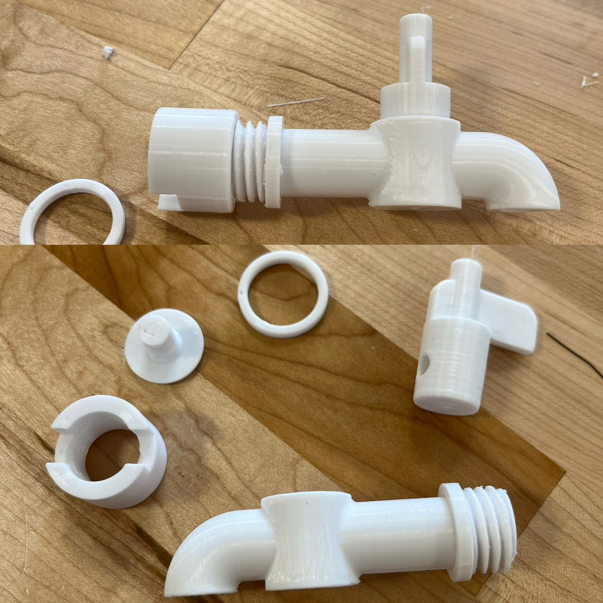
The cap was too hard to screw in so we will make it one percent smaller in the next iteration. For the ring, we want to print it with a more flexible material. The support was also very painful to remove so we are going to make the next iteration using organic support. 

## Third Iteration
We used the organic support and made the screw slightly smaller so that it can be screwed on easier and made space for the water proof coding. 
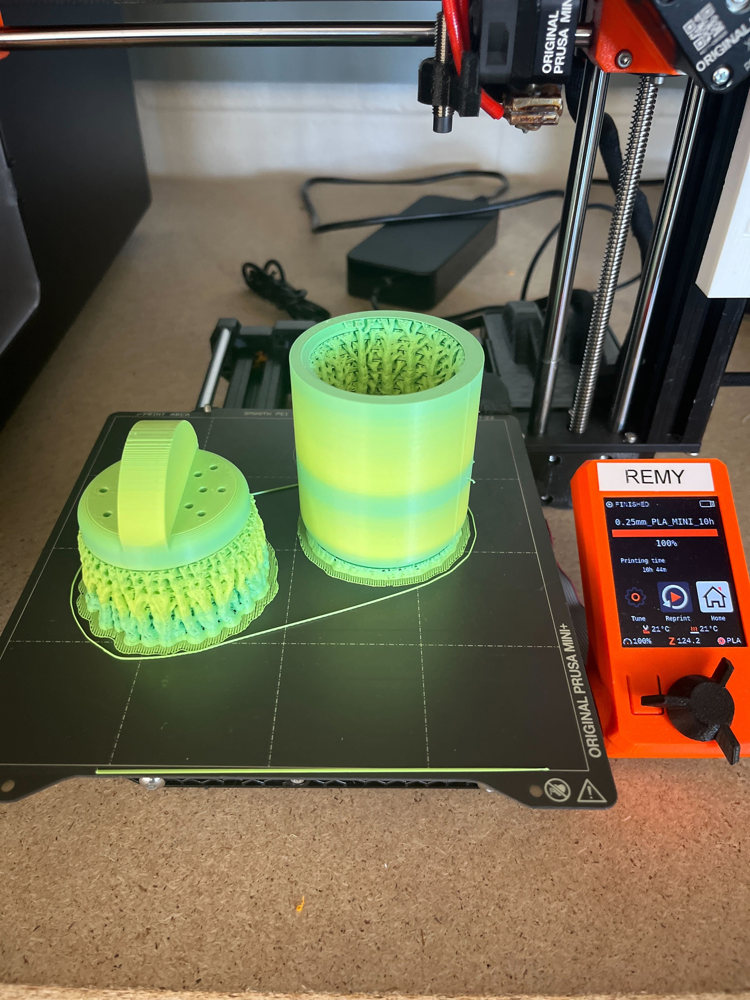

We also printed the handle on the tap slightly smaller, it is useable and not hard to twist now. We also printed the end bigger so it is easier to screw in. 
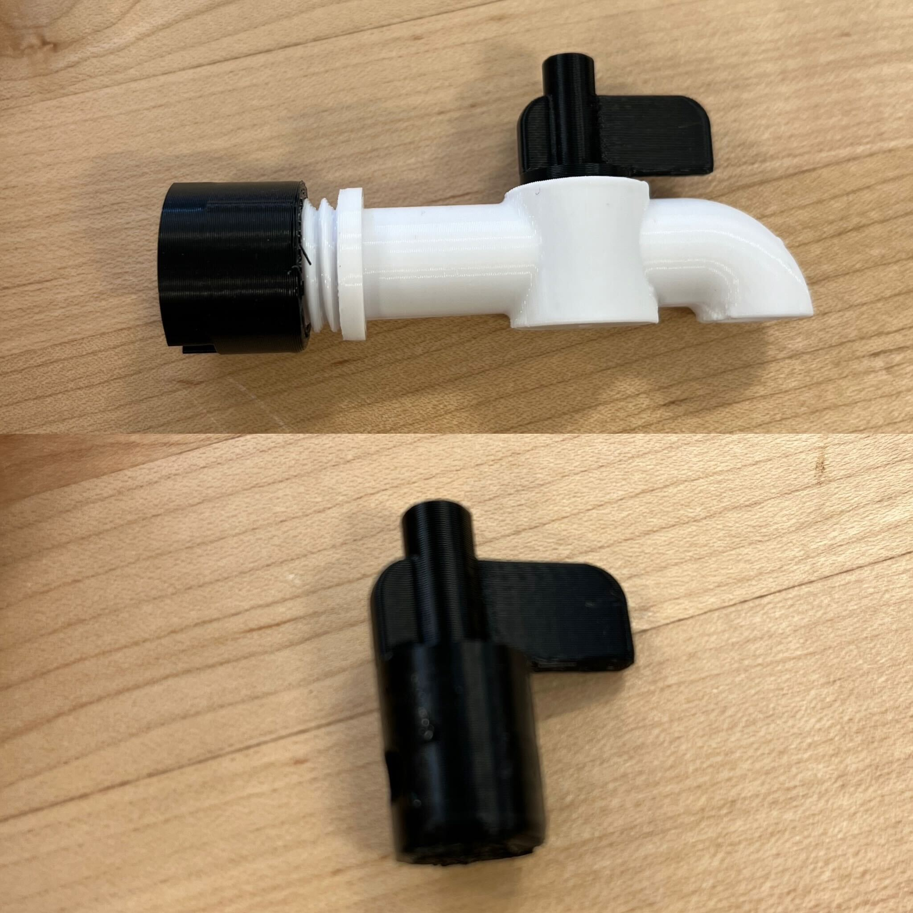
We started coding the filter with resin to make it water tight. We realized we need to print the top screw smaller to fit it into the container. 
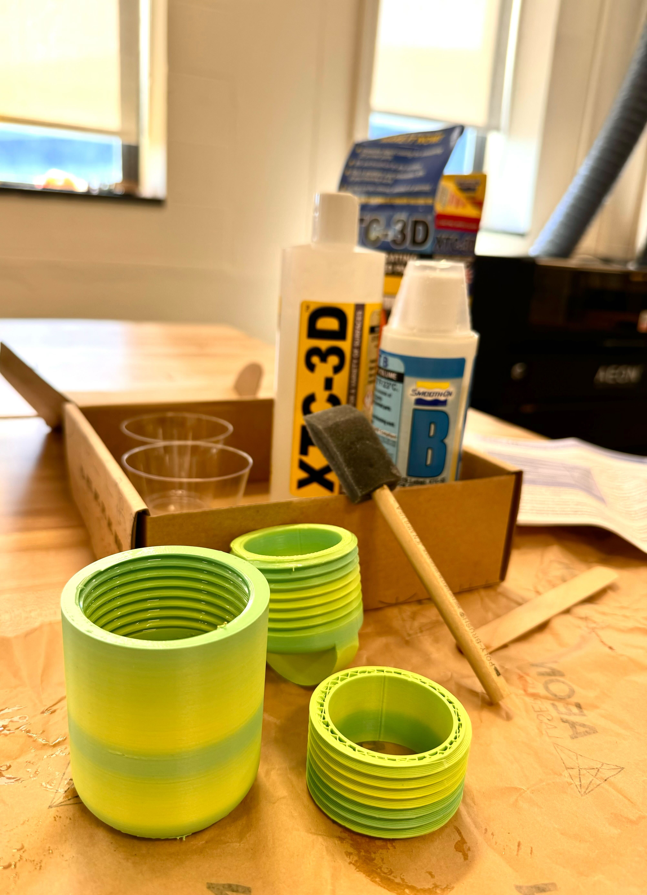

## Fourth Iteration
We will make a cad design to combine the tap with the filter. Then we will print it out and test it. Finally we will use PETG material to make the top screw of the tap so that it can be more flexible. 
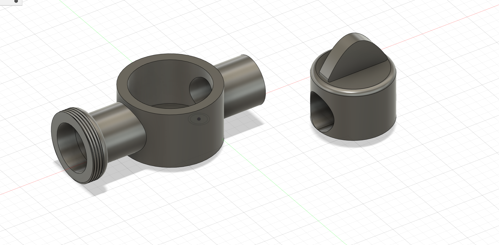
This end of the tap will be screwed onto the filter. 
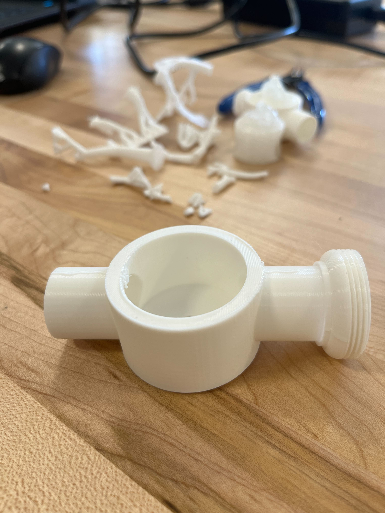

After a few failed prints we finally printed a successful tap. However, the knob of the tap was too big so we will make it smaller in the next iteration.

# CAM Setting
 25% hexagonal infill, recommend walls, with organic supports.
 (Will add a screenshot soon, stay tuned!)

# Conclusion
We have iterated through multiple designs and tested them to find the best design. We have learned that the filter must be easy to use and maintain, cheap to produce, and able to filter out the bacteria and viruses that cause waterborne diseases. We have also learned that the filter must be able to adapt to different containers and that the tap must be easy to use. We will continue to iterate on our design and test it to make sure that it meets the needs of the people in Cambodia.