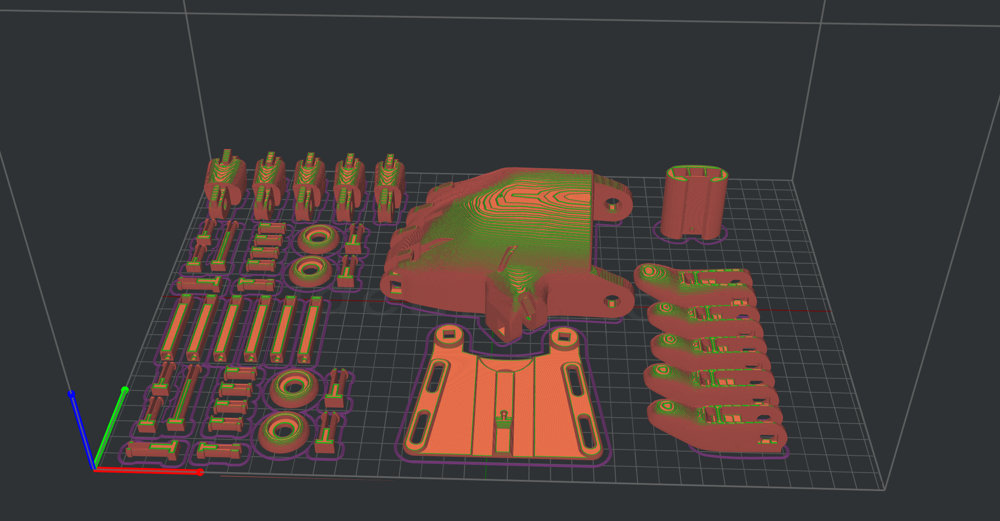
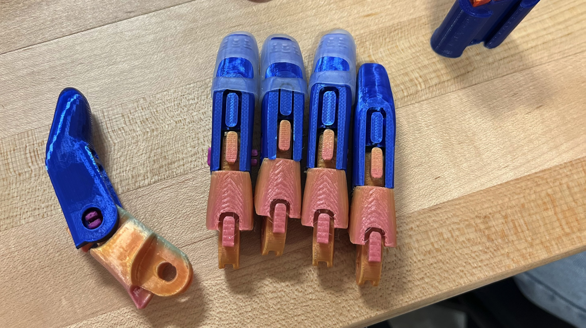
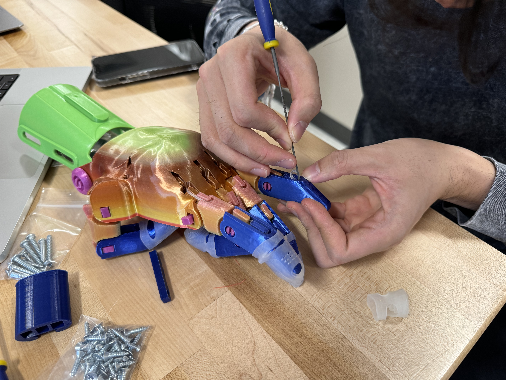
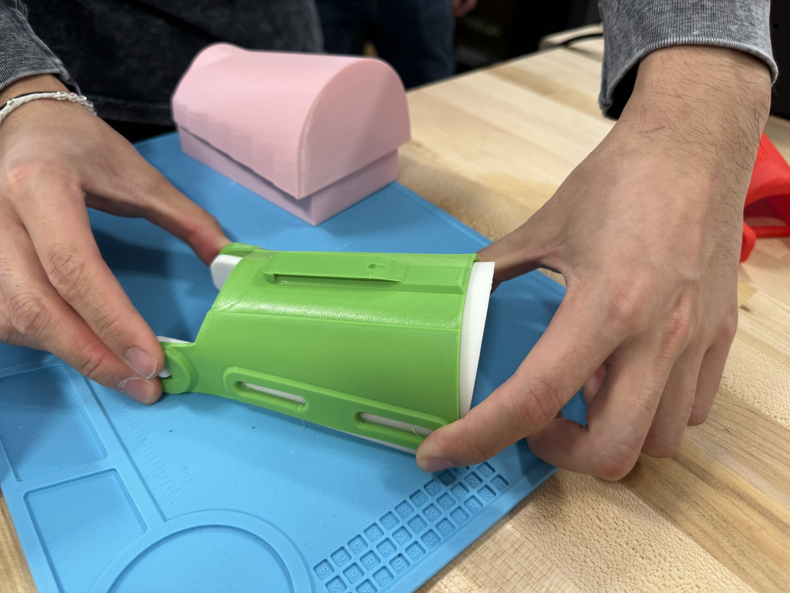
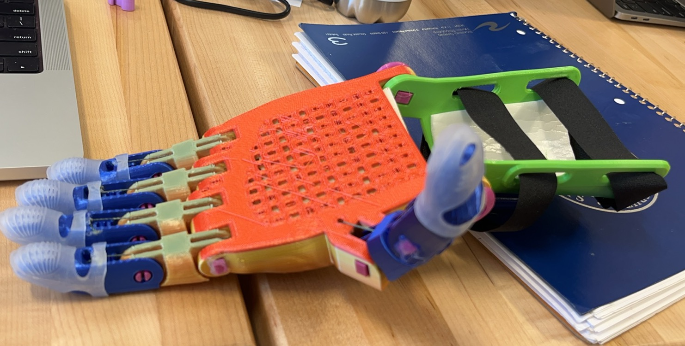
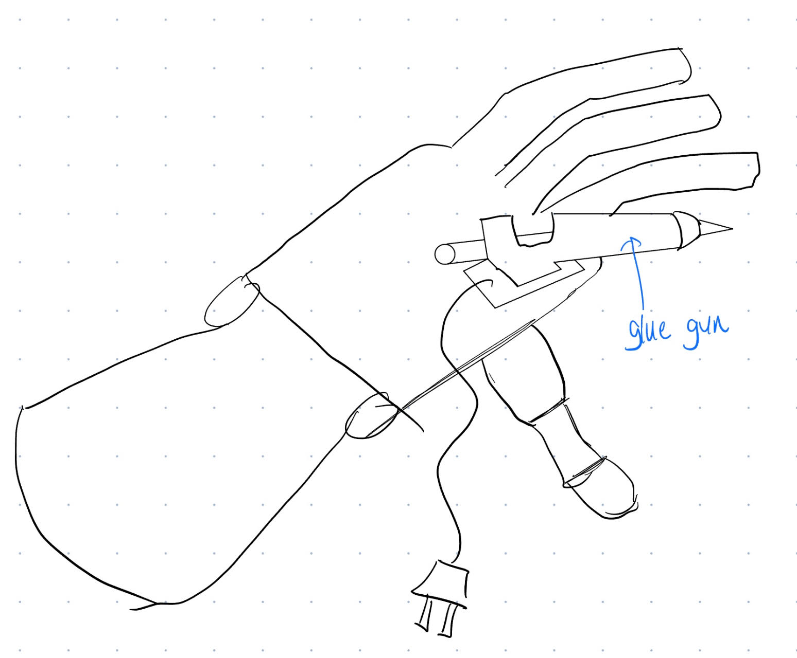
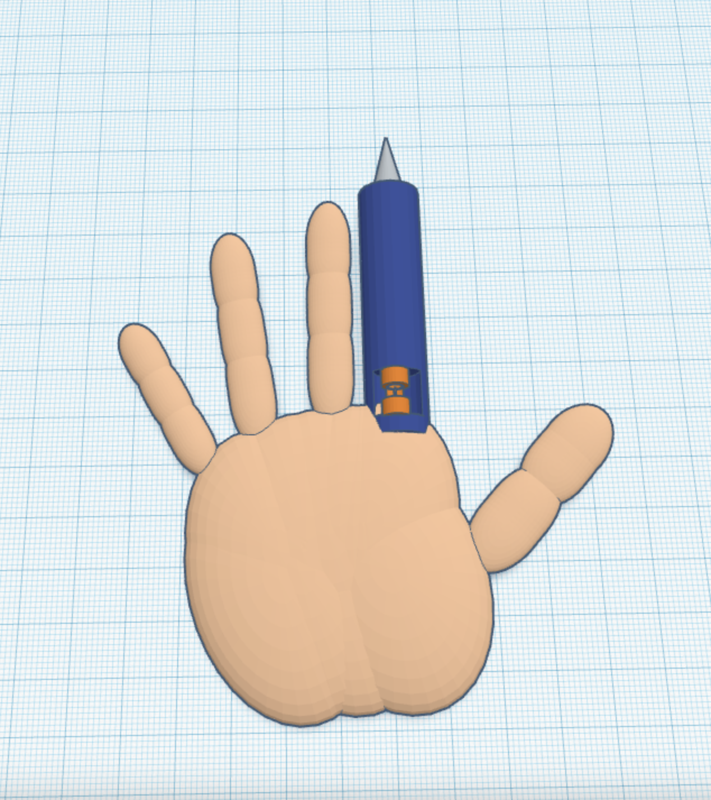

# Assemble the E-Nable Prosthetics Hand

## purpose and goals
The purpose of this project is to assemble a prosthetics hand using the E-Nable kit. The goal is to learn how to assemble a prosthetics hand and to understand the process of thermoforming a 3D printed part. The project also aims to explore the intersection of creativity and engineering by adding a creative twist to the prosthetics hand design.

## Introduction

The project started with one kit that comes with every parts that can not be 3-D printed such as the strings, screws, and rubber bands. The 3-D printed parts are the fingers, the palm, and the back of the hand. The first step was to 3-D print the parts. The second step was to assemble the fingers. The third step was to thermoform the wrist gauntlet. The fourth step was to assemble the strings. The final step was to test the hand.

## 3D printing the parts

For this project, we scaled the 3D printing parts to 150% and used `ideamaker` to slice the parts. Because we were going to use the **Raised3D E2** Printers. However, I started a little late, so I had to use the **Prusa MINI** printers which are actually faster because of their technology and I can print these parts separately on different machines. 

## Assemble the fingers
We first assembled the fingers by putting the 3-D printed screws into the holes of the fingers. 

Then we put the fingers into the palm and used the screws to connect the fingers to the palm.

As shown in the photo above, we put the rubber bands on the joints, so that the finger would be able to go back to the original position after bending. This allows the fingers to be able to bend and straighten with the help of the strings.
## Thermoforming the wrist gauntlet

When 3D printing the wrist part, it came out as a flat surface, and we are supposed to thermoform it to fit the wrist. We used a heat gun to heat the wrist part and then put it on the wrist to form the shape.

## Assemble the strings

We watched the video on how to assemble the strings and followed the instructions. We used the strings to connect the fingers to the wrist part. It turned out to be great. 

## Test the hand
After everything, the hand was able to work. We tested the hand by picking up a water bottle and it worked.

# review and contrast 
## Written Assembly Guide
The written assembly guide was very detailed and provided step-by-step instructions on how to assemble the prosthetic hand. It included clear diagrams and images to illustrate each step, making it easy to follow along. The guide also included tips and troubleshooting advice to help users overcome common challenges during assembly. Overall, it's very quick to look at as a reference.

## Video Assembly Guide
The video assembly guide was engaging and informative, providing a visual demonstration of how to assemble the prosthetic hand. The video guide showed each step of the assembly process in real-time, allowing users to follow along and see the process in action. The video guide also included voiceover narration to explain each step and provide additional context. It's easy to follow along. 

## Comparison
For the parts that are easy and more intuitive. The written guide gives a faster and straight froward guide as to what to put where. However, it is hard to include too much detail on a sheet of paper. The video guide takes longer to look at, and time is money to me. However, it has the details to follow along and we can save time by skipping through the video. 

# Creative Twist
We added a glue gun to this design
## Motivation
We had to glue gun some of the knots of the strings because they were not strong enough. We thought that it would be a good idea to replace one of the fingers with a glue gun.
## Sketch

Here is the sketch of the design.
## CAD Design
We also put this design into CAD

I found a hand model and I built the glue gun component from scratch because I can not find a free glue gun model. I used tinkerCAD because it's a easier interface.

# Reflection
From this project, I learned how to assemble a prosthetics hand and how to thermoform a 3D printed part. This has been an enlightening journey into the intersection of technology, creativity, and empathy. This project was not merely about assembling a functional prosthetic hand using the E-Nable kit; it pushed the boundaries by integrating a creative twist that aimed to enhance its utility and address a real-world challenge encountered during assembly.

The process of 3D printing the parts required adaptability and problem-solving, especially when I had to switch to the **Prusa MINI** printers due to time constraints. This change not only tested my ability to adjust to new circumstances but also provided an opportunity to explore the capabilities of different 3D printing technologies. The experience underscored the importance of flexibility and innovation in engineering solutions.

Assembling the fingers and connecting them to the palm was a meticulous task that required precision and patience. This stage of the project was crucial in ensuring that the prosthetic hand would not only fit well but also be capable of performing its intended functions. The addition of rubber bands to aid in finger movement highlighted the intricacy involved in mimicking human anatomy and functionality.

Thermoforming the wrist gauntlet was a particularly challenging yet rewarding part of the project. This process required a careful application of heat to mold the 3D printed wrist part into a form that comfortably fits the wearer. It was a vivid reminder of the importance of customization in prosthetic design and the need for a personalized approach to assistive technology.

The innovative twist of integrating a glue gun into the prosthetic design stemmed from a practical need encountered during the assembly process. This creative solution not only addresses a specific challenge but also opens up new possibilities for the functionality of prosthetic devices. It demonstrates how creativity and innovation can lead to meaningful improvements in assistive technologies.

Throughout this project, I gained invaluable skills in 3D printing, thermoforming, and prosthetic assembly. I also developed a deeper understanding of the challenges faced by individuals who rely on these technologies. This project was a powerful reminder of the impact that engineering can have on improving lives and the potential for creative solutions to enhance the functionality and utility of assistive devices.

In conclusion, this project was a profound learning experience that went beyond the technical aspects of assembling a prosthetic hand. It was an exploration of how engineering, creativity, and empathy can converge to create innovative solutions that make a difference in people's lives. I look forward to applying the insights and skills gained from this project to future endeavors in the field of engineering and technology.