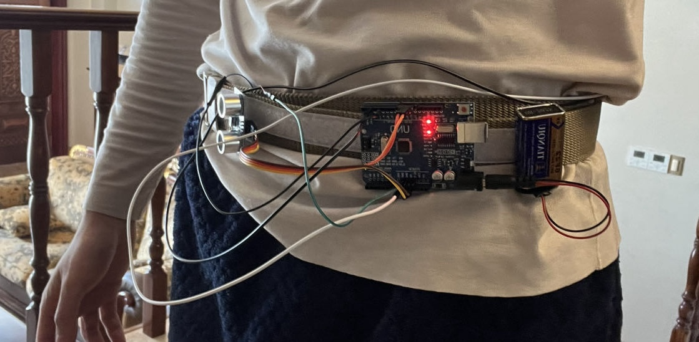

## Overview
This project investigates the impact of different types of vibration feedback on human perception of distance, a key aspect of sensory augmentation. Through a series of device iterations, the research explores how haptic feedback can enhance or alter the human ability to accurately gauge distances. This exploration is particularly relevant in the context of virtual reality (VR) and assistive technologies for individuals with visual impairments.

The devices, controlled by Arduino, utilize ultrasonic sensors for distance measurement and vibration motors (tactors) for haptic feedback. The project comprises four iterations of the device, each building upon the insights and learnings from the previous version.

[View the Code on GitHub](https://github.com/MARCOpo1o/Sensory-Augmentation-Device/tree/main)

## Literature Review and Motivation
The motivation for this project is rooted in a comprehensive literature review, focusing on:

- **Accessibility in VR**: Exploring how haptic feedback can substitute or complement visual input, especially for visually impaired users.
- **Immersive Experience in VR**: Understanding what factors contribute to immersion, with a specific focus on the role of touch.
- **Haptic Feedback Mechanisms**: Investigating different methods of simulating touch, including vibration and heat, and their effects on immersion and perception.
## Literature Review and Motivation
The project is motivated by a comprehensive literature review, highlighting:

- **Robotics and Remote Control Operations**: The potential for operators of drones and remote-controlled machines to use haptic feedback for better distance judgment, especially when visual feedback is insufficient.

- **Medical Field and Surgery**: The application of the device in surgeries, particularly minimally invasive procedures where direct visual cues are limited, to maintain optimal distances and enhance spatial awareness.

*Key findings and issues addressed include:*

- A significant learning curve in robot-assisted surgery, which could potentially be reduced by haptic feedback.
- The loss of haptic sensation in surgical procedures and its impact on performance.

These insights have shaped the hypothesis that haptic feedback can enhance distance perception and learning, offering substantial benefits in various professional fields.

## Project Goals
The overarching objectives of this project are to:
- Investigate how vibration feedback affects human perception of distance in contexts where visual feedback is inadequate.
- Develop a deeper understanding of how haptic feedback can enhance spatial awareness, particularly in remote operations and surgical environments.
- Create and refine prototypes that can be used in experimental setups and real-world applications, contributing to fields like medical surgery and robotics.
- Compare the impact of different haptic feedback mechanisms.
- Develop prototypes for experimental and practical applications in VR and accessibility.

## Getting Started
To replicate or contribute to this project, you will need an Arduino board, ultrasonic distance sensor, vibration motors, and the Arduino IDE. The repository includes detailed code for each device iteration.

