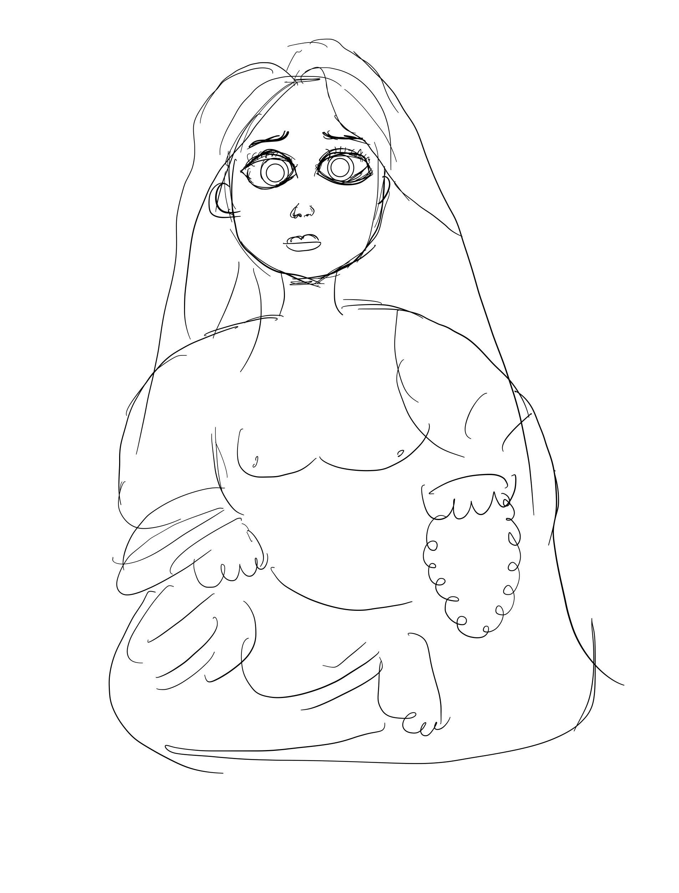
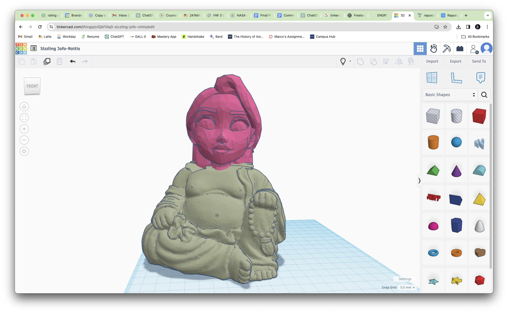
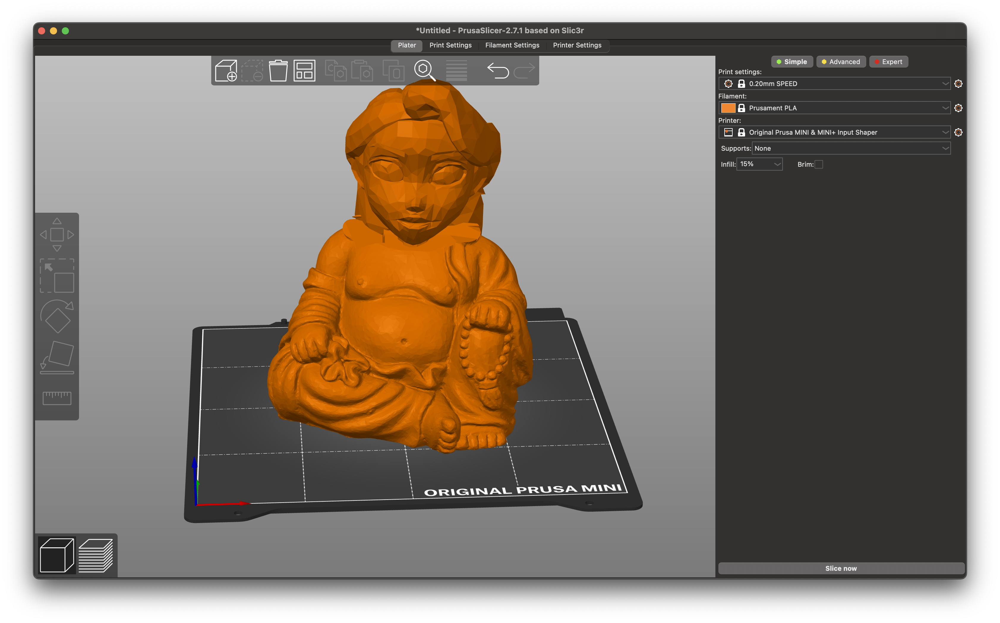
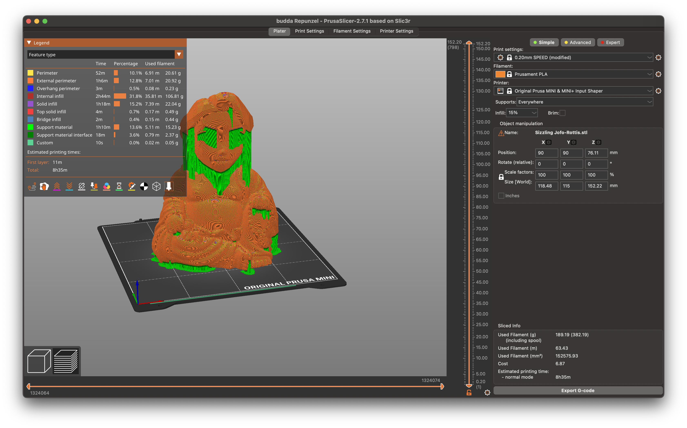
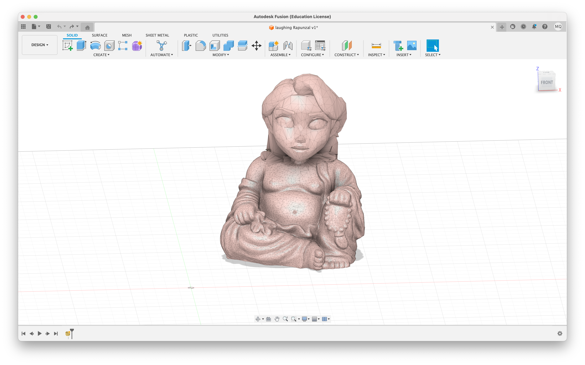
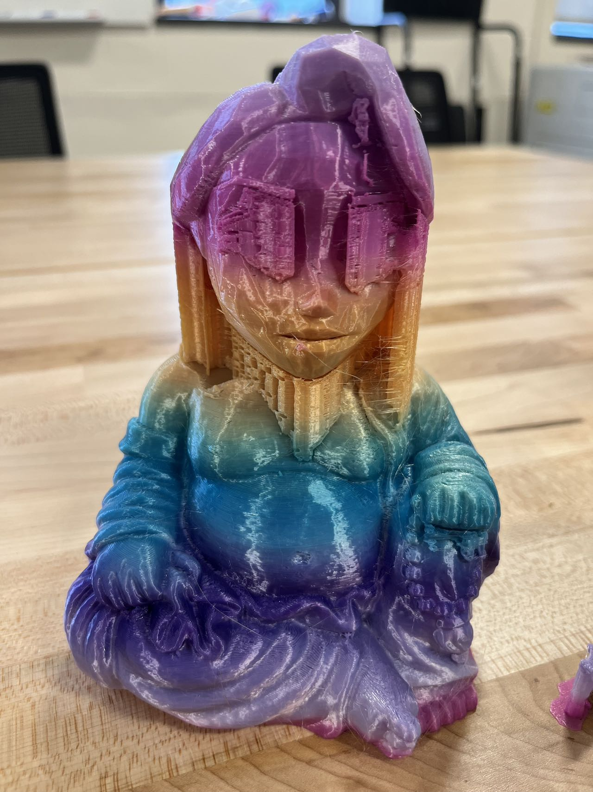
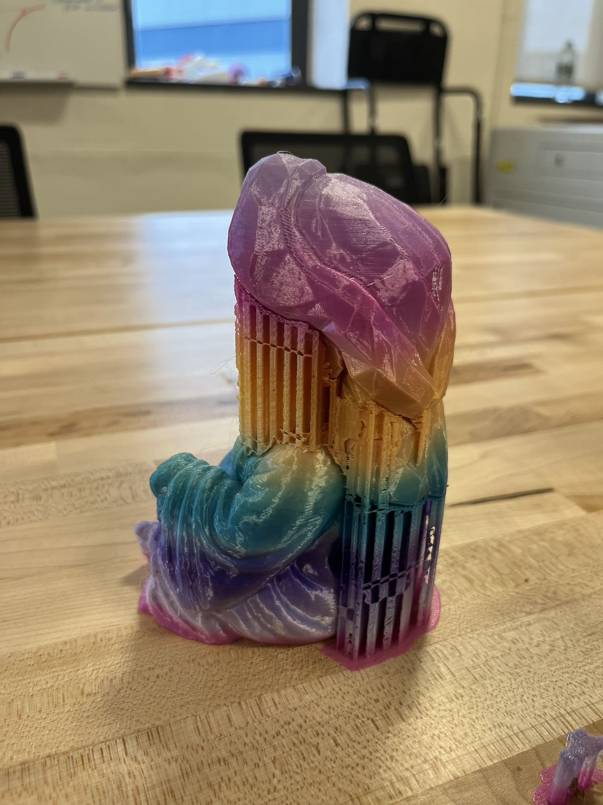
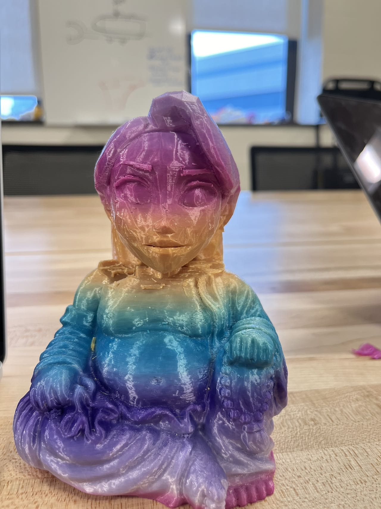

# Project Overview
In this project, I aim to creatively remix two distinct 3D models: I combined [Smiling Budda](https://www.thingiverse.com/thing:4395715)'s body with ['Rapunzel Mini](https://www.thingiverse.com/thing:3422255)'s face. Titled 'Laughing Rapunzel', this project explores the fusion of two different artistic themes while ensuring a respectful and playful representation.

# Design Concept and Goals
The concept was to blend the enchanting essence of Rapunzel with the tranquil demeanor of the Buddha. The goal was to create a hybrid model that captures the spirit of both figures, emphasizing joy and serenity without any religious connotation.

# Hand Drawing of the Design

# CAD Process in TinkerCAD
I used TinkerCAD for the initial 3D modeling process. Here's a glimpse of the model in its development stage. One of the harder part is that I had to make sure the face of Rapunzel fits the body of the Budda. The process is less user friendly than I first thought, because I have to create a new shape and set it as a hole to delete the body of Rapunzel. 

# Slicing Setup in Prusa Slicer
For the 3D printing preparation, I used Prusa Slicer. Below is the screenshot of the slicing setup, showing the trajectory preview and chosen settings.

# Fusion 360 for Advanced Design
I used Fusion 360 to further refine the model, adding intricate details and ensuring the model's stability. The software allowed me to optimize the model for 3D printing, ensuring that the final outcome would be both visually appealing and structurally sound.

# Final 3D Printed Model
The final outcome of the project was a successfully printed 'Laughing Rapunzel' model. The 3D print turned out great, reflecting the intricate details of the design.

# Reflection and Future Improvement
Reflecting on this project, I did pretty good. I think it's because the support I put on. I learned the importance of precision in both the CAD and CAM processes. Future improvements could focus on optimizing the model's stability and printability, potentially adjusting CAD design details and slicer settings for better results. The project underscored the delicate balance between artistic vision and technical feasibility in 3D printing.
