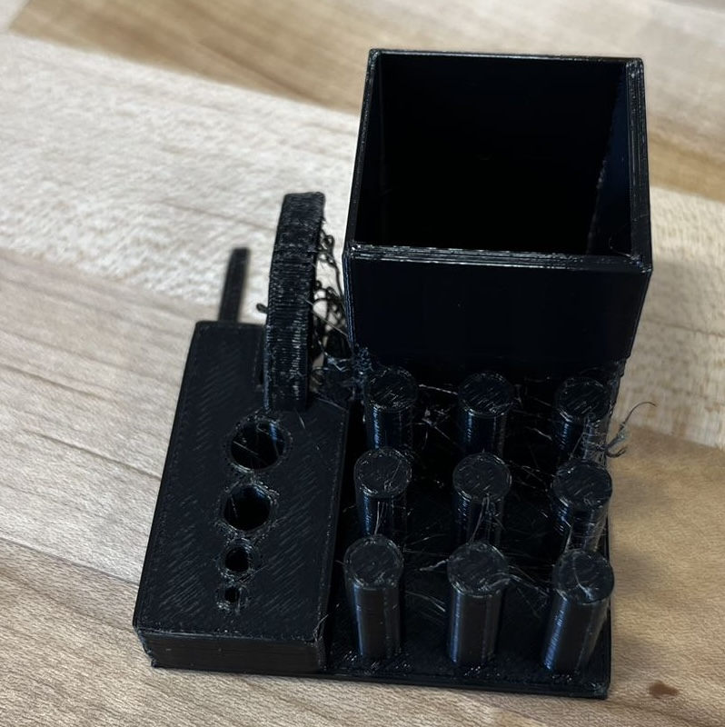
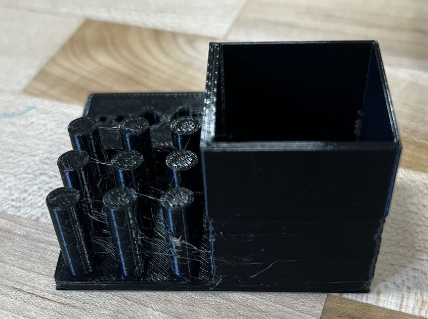
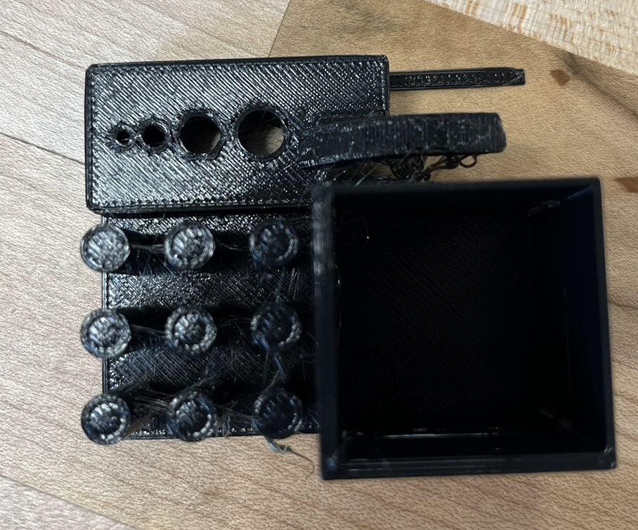

# 3D Print Stress Test Analysis

The stress tester I am trying to print has a mix of fine details such as small holes, overhangs, and cylindrical protrusions, which test the printer's precision and its ability to handle overhangs without support. I can't find the exact link I used. But I found a similar one [here](https://www.thingiverse.com/thing:2656594).

From the product, it is evident that the printer is capable of creating fine details to a certain degree. The small holes on the flat surface are well-formed, and the squares and rectangles are accurately produced with straight edges. This indicates a good level of precision in the XY plane. However, there are noticeable strings of plastic and minor imperfections on the parts of the object with overhangs, suggesting that the printer may struggle with cooling or extrusion control. This is a common challenge in 3D printing, where overhangs can lead to drooping if the material does not solidify quickly enough.

The cylindrical pillars show the printer's capability to create round shapes and vertical structures. The roundness of the pillars appears to be fairly consistent, although there is some evidence of oozing or stringing between the pillars. This could be due to the retraction settings on the printer not being fully optimized.

Overall, the printer demonstrates a commendable ability to handle moderately complex structures and details. To push the limits of what is possible to design and print, one could experiment with different materials, print speeds, temperatures, and retraction settings. Each of these variables can affect the print quality, especially for challenging geometries.

## File Formats and Their Impact

In terms of file formats, the 3MF file format would be advantageous for complex designs because it can encode color, texture, and other properties that are not supported by the STL format. The STL format, while widely supported and easy to use, represents only the surface geometry of the model without any additional attributes.

## Improvement Suggestions

Stringing in 3D prints often indicates a need for adjustments in temperature and retraction settings: lowering the nozzle temperature can reduce the oozing of plastic that leads to strings, and optimizing retraction settings can minimize the amount of filament pulled back during movements between print areas. Additionally, decreasing the print speed can allow better precision and give the material more time to cool, further mitigating the stringing effect.
